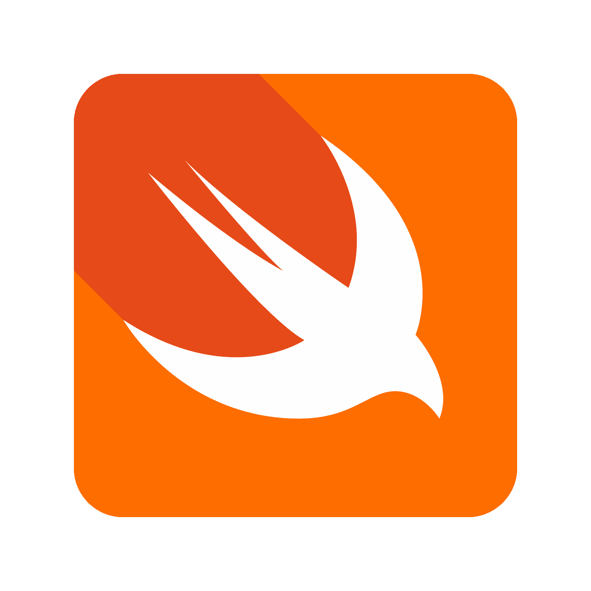

<div align="center">
    
    <h1 style="font-size: 50px">Swift</h1>
    <p>This repository is a demonstration of Swift's capabilities, highlighting its syntax, features, and integration with Apple's frameworks like SwiftUI, CoreML, and ARKit. It is an excellent starting point for developers curious about Swift and eager to see its real-world applications.</p>

</div>

 

---

## 📖 Table of Contents

1. [Introduction](#introduction)
2. [Projects Overview](#projects-overview)
3. [Setup and Requirements](#setup-and-requirements)
4. [How to Run](#how-to-run)
5. [Key Features](#key-features)

---

## Introduction

Swift is a modern, powerful, and versatile programming language developed by Apple. It is designed to combine performance, safety, and developer-friendly syntax, making it ideal for building apps across the Apple ecosystem and beyond. This repository showcases:

- Core language features like closures, generics, and optionals.
- Advanced paradigms like Protocol-Oriented Programming (POP) and Access Control.
- Integration with cutting-edge Apple frameworks like SwiftUI, CoreML, and ARKit.

---

## Projects Overview

### 1. **Swift Basics**
   - **Path:** `Basics/1-SwiftBasics/main.swift`
   - **Overview:** Demonstrates basic syntax, variable declarations, control flow, and functions.

### 2. **Access Control**
   - **Path:** `Basics/2-AccessControl/main.swift`
   - **Overview:** Explains Swift’s `open`, `public`, `internal`, `fileprivate`, and `private` access control levels.

### 3. **Optionals and Null Safety**
   - **Path:** `Basics/3-OptionalsAndNullSafety/main.swift`
   - **Overview:** Explores Swift’s optionals, optional chaining, and safe unwrapping with `if let` and `guard let`.

### 4. **Closures**
   - **Path:** `Basics/4-Closures/main.swift`
   - **Overview:** Covers closure syntax, trailing closures, and practical use cases like sorting and asynchronous programming.

### 5. **Generics**
   - **Path:** `Basics/5-Generics/main.swift`
   - **Overview:** Demonstrates how to write reusable and type-safe code using generics.

### 6. **Protocol-Oriented Programming**
   - **Path:** `Basics/6-ProtocolOrientedProgramming/main.swift`
   - **Overview:** Introduces protocols, protocol extensions, and their benefits over traditional inheritance.


### 7. **SwiftUI Example**
   - **Path:** `Basics/7-SwiftUI/`
   - **Overview:** Builds a simple UI using SwiftUI’s declarative syntax, showcasing cross-platform compatibility.

### 8. **CoreML Example**
   - **Path:** `Basics/8-CoreML/main.swift`
   - **Overview:** Demonstrates integrating a pre-trained CoreML model for image recognition.

### 9. **ARKit Example**
   - **Path:** `Basics/9-ARKit/main.swift`
   - **Overview:** Introduces augmented reality using ARKit, rendering a 3D object in real-world space.

---

## Setup and Requirements

### Prerequisites
- **Xcode**: Install the latest version from the [Mac App Store](https://apps.apple.com/us/app/xcode/id497799835).
- **Swift Version**: Ensure Swift 5.0 or later is installed (bundled with Xcode).
- **macOS**: macOS Monterey or later for ARKit and SwiftUI examples.

## Clone Repository
```bash
    git clone https://github.com/mgdino/all-about-swift.git
    cd all-about-swift
```

## How to Run
### 1. Open the Xcode IDE.
### 2. Navigate to the desired project folder (e.g., Projects/SwiftBasics).
### 3 Open main.swift or the relevant .swift file.
Run the program using the play button in Xcode or press Cmd + R.

## Key Features
### 🔹 Swift Language Features
- Readable Syntax: Easy to write and understand.
- Optionals and Null Safety: Avoids null pointer errors with optional types.
- Closures: Simplifies callbacks and asynchronous programming.
- Generics: Ensures type-safe, reusable code.
Protocol-Oriented Programming: Offers flexible alternatives to inheritance.

### 🔹 Apple Frameworks
- SwiftUI: Build UIs declaratively for Apple devices.
- CoreML: Integrate machine learning directly into apps.
- ARKit: Create augmented reality experiences effortlessly.
